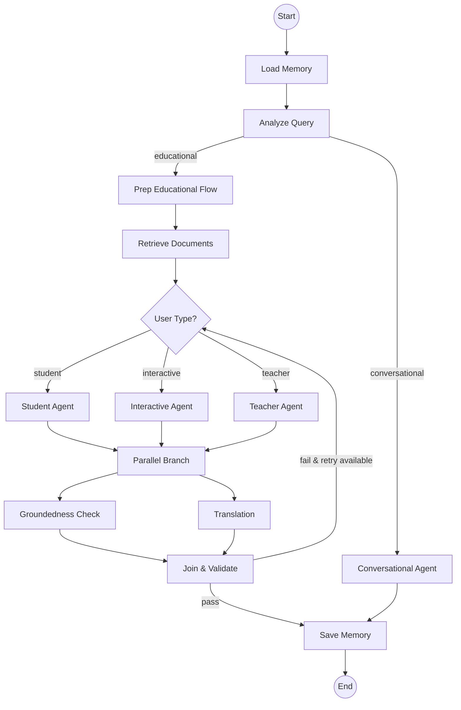

# VidyaAI: Internal Architecture & Logic Deep-Dive

This document provides a technical walkthrough of the "small things" that happen during a request, explaining the logic that moves the flow forward.

---

## 1. Request State: The [AgentState](file:///home/thinkpad/Desktop/IndiqAI/working/VIDHYA_AI_v2/state.py#78-125)
Every request is encapsulated in a central [AgentState](file:///home/thinkpad/Desktop/IndiqAI/working/VIDHYA_AI_v2/state.py#78-125) object. It acts as the "living ledger" that synchronizes all nodes.

### Field-by-Field Usage Guide

| Field Category | Key Fields | Purpose & System Usage |
|:---:|---|---|
| **Input Signals** | `user_type` | Routes to either [StudentAgent](file:///home/thinkpad/Desktop/IndiqAI/working/VIDHYA_AI_v2/agents/student_agent.py#17-243) or [TeacherAgent](file:///home/thinkpad/Desktop/IndiqAI/working/VIDHYA_AI_v2/agents/teacher_agent.py#16-245) pipelines. |
| | `student_grade` | Triggers persona-specific rules (Grade A: Technical, Grade D: Simple). |
| | `agent_mode` | Switches between `standard` (Direct answer) and [interactive](file:///home/thinkpad/Desktop/IndiqAI/working/VIDHYA_AI_v2/agents/interactive_student_agent.py#75-156) (Socratic tutoring). |
| **NLU Results** | `query_en` | The "workable" English version of the user request used for searching. |
| | `intent` | Influences RAG weights (e.g., higher semantic pull for `CONCEPT_EXPLANATION`). |
| | `query_type` | Drives the high-level routing (`conversational` vs `curriculum_specific`). |
| **Decision Logic**| `rag_quality` | Statistical flag (`low/high`). If `low`, it triggers the Reactive Web Search fallback. |
| | `is_correction` | Prevents infinite loops. Marked `True` if a response failed validation once. |
| | `is_session_restart` | Flag triggered if the user was inactive for >2 hours. Forces a "Welcome back" tone. |
| **Context Hub** | `session_metadata` | Stores extracted `lecture_id`, `chapter`, and `subject` used for DB filtering. |
| | `conversation_history`| Token-trimmed list of last 20 turns, used to reconstruct "standalone" queries. |
| **Knowledge** | `documents` | The raw list of Pinecone chunks found. Used by agents and fact-checkers. |
| | `prefilled_observations`| A "shortcut" bucket where RAG/Web results are placed to save the agent from re-searching. |
| **System Ops** | `llm_calls` | An atomic counter that tracks total OpenAI usage for the single request. |
| | [timings](file:///home/thinkpad/Desktop/IndiqAI/working/VIDHYA_AI_v2/state.py#11-14) | Dictionary tracking exactly how many seconds each node (Retrieval, Agent, etc.) took. |
| **Output State**| `response` | The final educational content generated by the agent. |
| | `final_language` | Sets the ISO code for the final UI display, bypassing redundant translation nodes. |

### Merging Mechanics (Parallel Nodes)
When parallel nodes (like Validation and Translation) return updates, the system uses specific merge functions:
- **`merge_citations`**: Purely appends new citations to the list (allowing duplication for validation audit).
- **`merge_list`**: Combines lists into a unique set (used for `subjects`).
- **`merge_metadata`**: Performs a `left | right` dictionary update.

---

## 2. Graph Topology & Workflow
The system is built on a directed acyclic graph (DAG) with conditional loops for self-correction.

### Detailed Node-by-Node Flow
1. **`load_memory`**: Parallel load from Redis (buffer) and MongoDB (summary). Prepares the initial state.
2. **`analyze_query`**: The "Router". Performs reconstruction and classification.
3. **`retrieve_documents`**: Fetches curriculum chunks. Executes speculative logic if triggered.
4. **Agent Nodes**: The "Brains". Run the ReAct loop using [AgentState](file:///home/thinkpad/Desktop/IndiqAI/working/VIDHYA_AI_v2/state.py#78-125). 
5. **Parallel Validation & Translation**: 
   - **Why Parallel?** To hide the latency of translation. While we fact-check (groundedness), we are simultaneously preparing the Marathi/Hindi/Gujarati version.
6. **`join_educational_validation`**: The "Guard Node". Checks the `groundedness_check` results.
   - **Loop-back**: If `is_valid=False`, it routes back to the agents with `is_correction=True` and feedback text.
7. **`save_memory`**: Atomic write to MongoDB and Redis to ensure the next turn is contextual.

---

## 3. Intelligence: The Query Classifier
Before any processing happens, the [QueryClassifier](file:///home/thinkpad/Desktop/IndiqAI/working/VIDHYA_AI_v2/services/query_classifier.py#39-194) analyzes the raw input.

### The Science of Thresholds
| Decision Point | Threshold / Value | Action / Logic |
|:---:|:---:|---|
| **Input Magnitude** | > 5,000 Chars | Automatic LLM-based summarization to preserve context window. |
| **Search Window** | 10 turns | Standalone reconstruction uses the exact last 10 messages. |
| **Speculative Skip** | <= 2 Words | Skips speculative RAG to avoid useless vector searches on greetings. |
| **RAG Quality: High**| Score > 0.85 | Tells the agent: "Curriculum is perfect. Answer IMMEDIATELY." |
| **RAG Quality: Med** | Score > 0.70 | "Stick to local knowledge first." |
| **RAG Quality: Low** | Score <= 0.70 | Triggers the **Reactive Web Search** tool automatically. |
| **Inclusion Cutoff** | Score >= 0.40 | Minimum score for a document to be "trusted" by the system. |
| **Tool Execution Cutoff** | Score >= 0.450 | A higher threshold used specifically when the [RetrievalTool](file:///home/thinkpad/Desktop/IndiqAI/working/VIDHYA_AI_v2/tools/retrieval_tool.py#13-130) is executed manually by agents. |
| **Validation Context**| Top 5 Docs | The Guardian fact-checks only against the highest-ranking knowledge. |

### Standalone Reconstruction
If a user says *"Explain it further"*, the Classifier looks at the **History (last 10 messages)** and rewrites the query to *"Explain Photosynthesis further"*. This ensures Retrieval and Agents have complete context for every turn.

### Classifier Cache (Stability)
The classification result is cached using an MD5 hash of `(query + latest_2_history_turns)`. This minimizes latency for recurring follow-ups while allowing history to drift.

### Ambiguity & Clarification (HITL Logic)
The system prevents "guessing" when a query is vague (e.g., "Transformers").
- **Logic**: If the Guardian detects strong evidence for multiple distinct contexts (AI Neural Networks vs. Electrical Transformers) in the top 5 documents, it sets `needs_clarification=True`.
- **Action**: The Agent's drafted response is **overridden** by a clarifying question (e.g., "I found two topics. Which one did you mean?").

### Intent & Category Routing
- **`conversational`**: Greetings or "thanks". Skips RAG and goes to a specialized social agent.
- **`curriculum_specific`**: Educational queries. These enter the full RAG + ReAct pipeline.

---

## 4. Data Flow: Retrieval Strategy
The [RetrieverService](file:///home/thinkpad/Desktop/IndiqAI/working/VIDHYA_AI_v2/services/retriever.py#43-232) doesn't just search; it computes the best source of knowledge.

### Hybrid Search Nuances
We use **Pinecone Hybrid Search**, combining Dense (meaning) and Sparse (keywords) vectors.
- **Alpha Weighting**: 
  - `CONCEPT_EXPLANATION` (Alpha **0.7**): Favors semantic meaning to find deep explanations.
  - `HOMEWORK_HELP` (Alpha **0.4**): Favors keyword matching to find specific problem statements.

### The Web Search Decision Tree
The system uses statistical quality scores to decide whether to supplement local knowledge with the web:

1.  **Speculative**: Starts early if the query looks educational (Query length > 2 words or contains educational keywords like "how", "what", "why", "explain", "describe", "define").
2.  **Proactive**: Triggered immediately if keywords like "latest", "recent", or "news" are found.
3.  **Reactive (Statistical Fallback)**: 
    *   **Threshold**: Triggered ONLY IF the top RAG similarity score is **< 0.70**.
    *   **Score Filtering**: Only documents with a similarity score **>= 0.40** are passed to the agent and included in citations to prevent noise.
4.  **Web Cache**: Search results are cached for **24 hours (86400s)** as current facts are assumed stable for one day.
5.  **Capability**: Uses the OpenAI `responses.create` API with `web_search_preview` model capability.

---

## 5. The Agent Brain: ReAct & Persona
The system chooses an agent (Student/Teacher) that follows the **ReAct (Reasoning and Acting)** framework.

### Pre-seeding Logic (Proactive Observation)
To save time, results from the `RetrieveDocumentsNode` are "injected" into the ReAct agent's thoughts *before* it starts. This is done by simulating a previous `AIMessage` with `tool_calls` and corresponding `ToolMessage` observations.

### Sequential Policy Enforcement
If `enforce_sequential` is enabled, the agent is programmatically blocked from calling `retrieve_documents` and `web_search` in the same step. It receives a guided error forcing it to evaluate curriculum data before going to the web.

### Tone & Rule Injection (Grade A-D)
Vidya's personality is dynamically injected based on the user's `student_grade`:
- **Grade A (The Architect)**: Required to use technical terms (e.g., "Kinetic Impedance") and end with a "What if" technical prompt.
- **Grade D (The Coach)**: Forbidden from using jargon. Must use a story-telling approach and say "You've got this!".

### Corrective Synthesis
If the agent reaches its **Max Iterations (5)** without a final answer:
1. It does NOT fail immediately.
2. It triggers a "Synthesis" prompt: "You reached max steps. Based on collected info, provide the best possible answer."
3. This ensures the student gets *something* helpful even if the search was complex.

### Final Output Guardrails
- **Brevity**: Strictly **50-100 tokens** per response.
- **Notation**: [MathJax](file:///home/thinkpad/Desktop/IndiqAI/working/VIDHYA_AI_v2/agents/react_agent.py#303) is mandatory for all formulas (`\( ... \)` or `\[ ... \]`).

---

## 6. Service Lifecycle & Instance Management
The system uses a centralized factory pattern in [BackendApp](file:///home/thinkpad/Desktop/IndiqAI/working/VIDHYA_AI_v2/main.py#46-339) to manage external service lifecycles.

### External Service Handlers
| Service | Initialization Point | Persistence Logic |
|:---:|---|---|
| **OpenAI (ChatOpenAI)** | `_build_graph` | Two distinct instances: `llm` (Primary) and `llm_fast` (Validator). Shared across all nodes for consistency. |
| **Pinecone** | [RetrieverService.__init__](file:///home/thinkpad/Desktop/IndiqAI/working/VIDHYA_AI_v2/services/retriever.py#46-67) | Client is instantiated on service startup and persists for the process lifetime. |
| **Redis** | `lifespan` (Startup) | Persistent `aioredis` connection with 5-stage exponential backoff retry. |
| **MongoDB (Beanie)**| `lifespan` (Startup) | Asynchronous `Motor` client with global Beanie model registration. |

### Dependency Injection Pattern
Vidya doesn't use a formal DI framework. Instead, `main.py` performs manual wiring:
1. **Low-Level Clients**: Created during `lifespan` or service `__init__`.
2. **Intermediate Services**: (Memory, Retriever, Translator) receive clients in their constructors.
3. **Graph Nodes**: Receive services as pre-configured objects.
4. **The Graph**: Is compiled **once** at startup and reused, ensuring that expensive client initializations only happen once.

---

## 7. Memory Engine: Redis & MongoDB
### Short-Term (Redis Buffer)
- **Message Limit**: Keeps the last **20 messages** for high-speed retrieval.
- **Persistence TTL**: Every buffer has a **1-hour (3600s)** expiration to manage memory footprint.
- **Context Trimming**: Uses a token-aware sliding window of **2000 tokens** to prevent prompt truncation.
- **Legacy Normalization**: Automatically converts old `text` field messages to the standard `content` schema during loading.

### Long-Term (MongoDB)
- **Summarization Trigger**: Runs in the background every **10 turns**. It fetches the last **20 turns** to create/update the summary.
- **Session Restart (7200s)**: If a user returns after **2 hours**, the `is_session_restart` flag is triggered **ONLY IF** the session already contains historical messages. Empty old sessions are treated as brand new.
- **Atomic Persistence**: Uses `$push` and `$set` for `ChatMessage` additions to guarantee data integrity during concurrent user/assistant writes.

---

## 8. The Guardian: Parallel Validation
To ensure the Great UX, two things happen in parallel before you see the message:
1. **Groundedness Check**: Uses a structured LLM output (`is_valid`, `reasoning`, `feedback`).
2. **Link Blocker**: A strict instruction with **100% enforcement** policy to remove external URLs.
3. **Retry Limit**: Enforces a maximum of **1 self-correction** to prevent token loops.

### Performance Statistics
- **Target Latency**: Optimized to sub-second levels for social turns (~30-750ms).
- **LLM Consolidation**: Reduces LLM calls from 3-4 down to **1 in the fast-path** and **2-3 in the parallel educational path**.